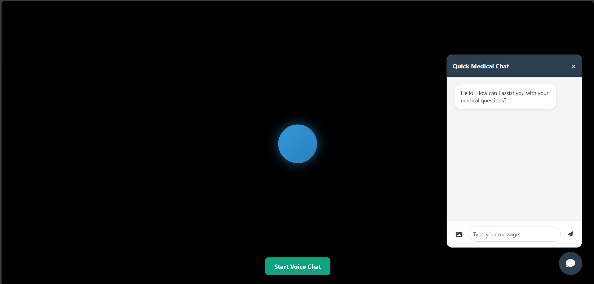
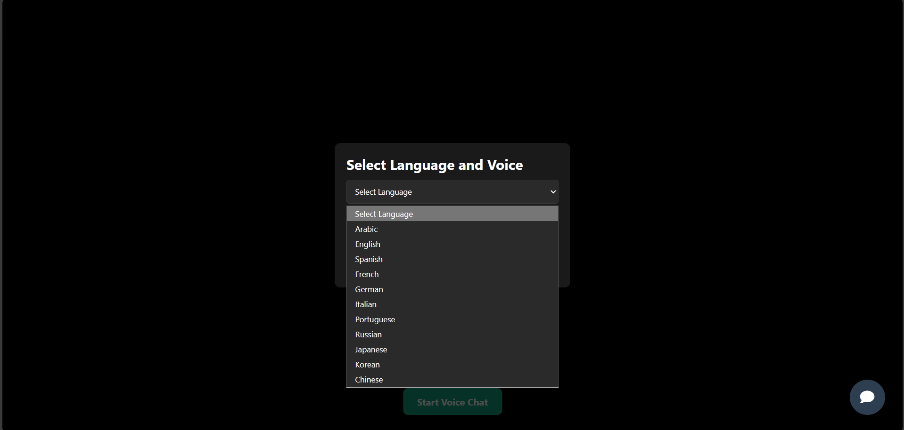

# 🏥 Smart Medical AI Assistant


An advanced, multimodal medical assistant designed to provide intelligent health consultations through voice, text, and image analysis. Leverages the power of **Azure Cognitive Services** and **OpenAI's GPT-4** to deliver accurate, multilingual support in real-time.

---

## 📸 User Interface

The application features a modern, responsive user interface designed for intuitive navigation and interaction.

| **Dashboard & Voice Interface** | **Medical Analysis & Chat** |
|:---------------------------:|:-----------------------:|
|  |  |
| *Real-time voice activity visualization with the interactive animated orb.* | *Detailed medical image analysis and chat history interface.* |

---

## 🏗️ System Architecture

The application follows a modern event-driven architecture using WebSockets for real-time communication.

```mermaid
graph TD
    User([User]) <--> Frontend[Frontend (HTML/JS)]
    Frontend <-->|Socket.IO| Backend[Flask Backend]
    
    subgraph Azure Cloud Services
        Backend -->|STT & TTS| Speech[Azure Speech Services]
        Backend -->|Image Analysis| Vision[Azure Computer Vision]
        Backend <-->|Intelligence| OpenAI[Azure OpenAI (GPT-4)]
    end
    
    Speech -.->|Audio Stream| Backend
    Vision -.->|Tags & Captions| Backend
```

---

## ✨ Key Features

- **🗣️ Intelligent Voice Interaction**
  - **Real-time Processing**: Streaming audio processing for low-latency responses.
  - **Visual Feedback**: Dynamic animated orb (`.animated-ball`) that changes state (Idle 🔵, Recording 🔴, Speaking 🟢).
  - **Natural Voices**: Utilizes Azure Neural TTS for human-like speech output.

- **🌍 Multilingual Support**
  - Automatically detects and speaks 12+ languages including:
    - 🇸🇦 Arabic (Saudi) | 🇺🇸 English (US) | 🇫🇷 French | 🇪🇸 Spanish
  - **Smart Translation Layer**: 
    - Automatically translates Arabic queries to English for GPT-4 processing.
    - Translates responses back to Arabic while preserving medical accuracy.

- **👁️ Medical Image Analysis**
  - **Dual-Engine Analysis**:
    1. **Azure Computer Vision**: Extracts visual tags, objects, and text from the image.
    2. **GPT-4 Vision**: Synthesizes visual data with medical knowledge to generate a comprehensive report.
  - **Detailed Reports**: Provides findings, detected conditions with confidence scores, and professional recommendations.

- **🤖 Advanced AI Brain**
  - Powered by **GPT-4-mini** via Azure OpenAI.
  - System prompts specifically tuned for medical context and safety.

---

## 🔌 API Documentation (Socket.IO)

The backend communicates with the client using the following Socket.IO events:

| Event Name | Direction | Payload | Description |
|------------|-----------|---------|-------------|
| `connect` | Client → Server | N/A | Initiates the WebSocket connection. |
| `audio_chunk` | Client → Server | `{chunk: base64, language: str}` | Streams audio data for Speech-to-Text processing. |
| `processing` | Server → Client | `{status: "processing"}` | Notifies the client that the server is working on the request. |
| `chatbot_response` | Server → Client | `{text: str, audio: base64, ...}` | Returns the AI's text response and synthesized audio. |
| `analyze_image` | Client → Server | `{image: base64, prompt: str}` | Submits an image for medical analysis. |
| `image_analysis` | Server → Client | `{analysis: markdown_str}` | Returns the detailed analysis report. |
| `end_recording` | Client → Server | `{requestSummary: bool}` | Signals end of session; optionally requests a summary. |

---

## 🛠️ Technology Stack

| Component | Technology | Description |
|-----------|------------|-------------|
| **Backend** | Python, Flask | Core application server. |
| **Real-time** | Flask-SocketIO, Gevent | Handles async WebSocket connections. |
| **AI & ML** | Azure OpenAI, Azure Cognitive Services | STT, TTS, Computer Vision, and LLM capabilities. |
| **Frontend** | HTML5, CSS3, Vanilla JS | Responsive UI with animations (No heavy frameworks). |
| **Audio** | Pydub, ffmpeg | Audio format conversion and manipulation. |

---

## 🚀 Installation & Setup

1.  **Clone the Repository**
    ```bash
    git clone https://github.com/yourusername/medical-chatbot.git
    cd medical-chatbot
    ```

2.  **Install Dependencies**
    Ensure you have Python 3.8+ installed:
    ```bash
    pip install -r requirements.txt
    ```
    *Note: [ffmpeg](https://ffmpeg.org/download.html) is required for audio processing.*

3.  **Configuration**
    Open `app.py` and configure the following keys (or use environment variables):
    
    | Variable | Description |
    |----------|-------------|
    | `speech_key` | Azure Speech Service API Key |
    | `service_region` | Azure Region (e.g., `uaenorth`) |
    | `openai_client` | Azure OpenAI Endpoint & Key |
    | `vision_key` | Azure Computer Vision Key |

4.  **Run the Application**
    ```bash
    python app.py
    ```

5.  **Access the App**
    Open `http://localhost:8000` in your browser.

---

## ❓ Troubleshooting

| Issue | Possible Solution |
|-------|-------------------|
| **Microphone not working** | Ensure your browser has permission to access the microphone. Check if the site is served over HTTPS (or parameters used for localhost). |
| **"Speech recognition failed"** | Verify your `speech_key` and `service_region` in `app.py`. Check your internet connection. |
| **Audio not playing** | Some browsers block autoplay. Interact with the page (click anywhere) before starting a chat. |
| **Socket Connection Error** | Ensure `gevent` is installed and you are not behind a firewall blocking WebSockets. |

---

## ⚠️ Disclaimer

> This AI assistant is for informational purposes only and does not substitute professional medical advice, diagnosis, or treatment. Always seek the advice of your physician or other qualified health provider with any questions you may have regarding a medical condition.
